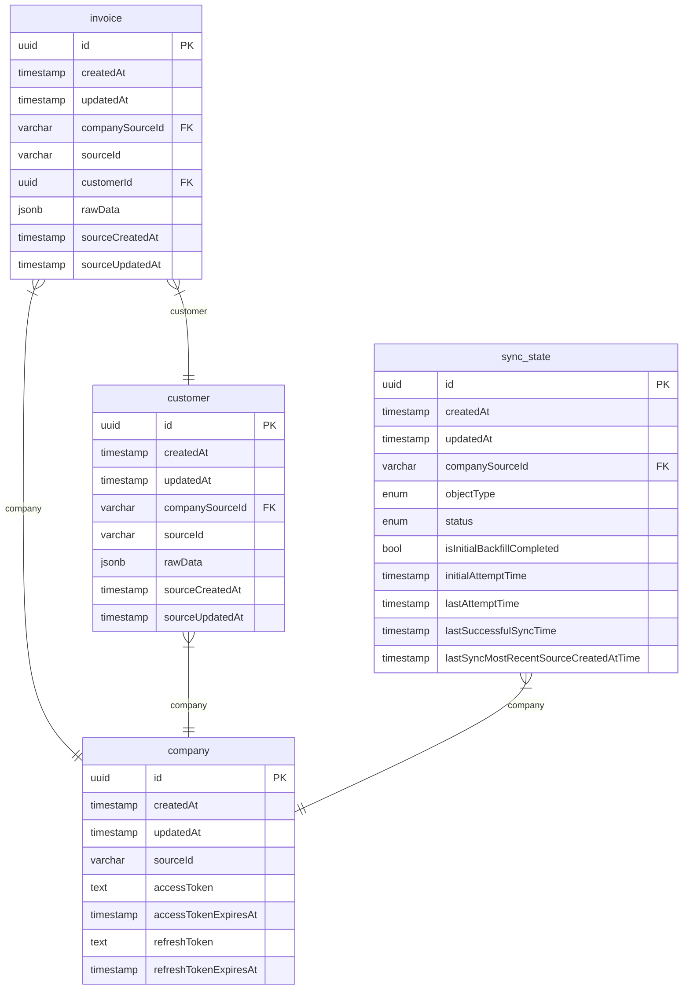

# QuickBooks Integration

NestJS service for syncing QuickBooks Online data with OAuth authentication and background job processing.

## Local Setup

### 1. Start Infrastructure

```bash
docker compose up -d
```

Starts PostgreSQL (port 5432) and Redis (port 6379) in the background.

**To reset infrastructure and clear all data Later**:
```bash
docker compose down -v && docker compose up -d
```

The `-v` flag removes volumes, clearing all database data and Redis queues.

### 2. Configure Environment

```bash
cp .env.example .env
```

Edit `.env` and add your QuickBooks OAuth credentials:

```env
QBO_CLIENT_ID=your_client_id
QBO_CLIENT_SECRET=your_client_secret
```

Get credentials from the [Intuit Developer Portal](https://developer.intuit.com/).

**Important**: Make sure you have the following redirect URI configured in your QuickBooks app:
- `http://localhost:3000/v1/oauth/callback/qbo`

### 3. Install Dependencies

```bash
pnpm install
```

Installs all project dependencies.

### 4. Run Database Migrations

```bash
npx nx migration:deploy server
```

Creates database schemas and tables in PostgreSQL.

### 5. Start Application

```bash
npx nx start server
```

Server starts at `http://localhost:3000`

## Access Points

- **Application**: `http://localhost:3000`
- **Health Check**: `http://localhost:3000/v1/health`
- **Redis UI**: `http://localhost:8001`


## Authorization Flow

### OAuth 2.0 Flow

1. **User Authorization**: User visits `/v1/oauth/authorize/:integration` and gets redirected to Intuit's authorization page
2. **User Consent**: User grants permission to access their QuickBooks Online company
3. **Authorization Code**: Intuit redirects back to `/v1/oauth/callback/:integration` with an authorization code
4. **Token Exchange**: App exchanges the authorization code for access and refresh tokens
5. **Initial Sync**: App may trigger initial data backfill for the connected company if not done previously.

> in case of quickbooks online integration param is qbo

### Dynamic Integration Support

The OAuth controller uses a registry pattern (`OAuthRegistryService`) for service discovery. Each integration (QBO, Xero, etc.) implements `AbstractOAuthService` and registers itself. Adding new integrations requires:
- Implementing `AbstractOAuthService`
- Registering in the integration module's `onModuleInit`

### Access Token Refresh

**Current Implementation (Single Instance)**:
- Access tokens are stored in Redis with TTL set to expiration time minus 5 minutes buffer
- Redis key-space notifications (`KEx`) detect key expiration events
- On expiration, the service automatically refreshes the token using the refresh token
- Works for single server deployments

**Multi-Instance Considerations**:
- Current implementation may missed refreshing token, for refresh attempts across instances
- **Solution**: Use distributed locking (Redis-based) with key-event notifications to ensure only one instance refreshes
- **Alternative**: Queue scheduler (out of scope) - more reliable but requires additional work

## Initial Backfill

### Overview

Initial backfill performs a one-time full synchronization of all historical data when a company first connects. It runs once per company per object type (Customer, Invoice, etc.).

### Strategy

**Execution Flow**:
- Triggers automatically when a company connects for the first time
- Processes each object type independently with dedicated sync state tracking
- Maintains sync state per company/objectType combination to track progress

**Data Fetching Approach**:
- Fetches data in batches of 1000 records per page
- Orders by creation time (oldest first) to ensure chronological processing
- Processes all pages sequentially until all historical data is retrieved
- Saves each batch incrementally to database as it's fetched

**Timing and State Tracking**:
- Records `initialAttemptTime` when backfill begins for an object type
- On successful completion, sets `lastSuccessfulSyncTime = initialAttemptTime`
- This ensures any updates made to records during the backfill period are captured in the subsequent incremental sync

**Processing Order**:
- Customers are processed first (priority 1), followed by Invoices (priority 2)
- This ordering ensures all customer references exist before invoices are synced
- Prevents referential integrity issues and missing customer data for invoices

**Transition to Incremental Sync**:
- Once initial backfill completes, system automatically switches to incremental sync
- Incremental sync only fetches entities where `LastUpdatedTime >= lastSuccessfulSyncTime`
- This ensures continuous synchronization of new and updated records going forward

## Incremental Sync

### Overview

Incremental sync continuously monitors and synchronizes only new and updated records after initial backfill completes. It runs automatically every 5 minutes for each company/objectType combination.

### Strategy

**Execution Schedule**:
- Triggers automatically every 5 minutes via BullMQ repeatable jobs
- Runs independently for each company and object type
- Processes only records that have been updated since the last successful sync

**Data Fetching Approach**:
- Uses timestamp-based filtering: `Metadata.LastUpdatedTime >= lastSuccessfulSyncTime`
- Fetches data in batches of 1000 records per page
- Processes all pages sequentially until no more updates are found
- Updates `lastSuccessfulSyncTime` to the sync execution time on completion

**Why Timestamp-Based Instead of Change Data Capture**:
- Change Data Capture (CDC) operations returns data for the last 30 days only
- If a company disconnects for 30+ days and reconnects, CDC would miss older changes
- Timestamp-based approach handles any disconnection period, ensuring no data is missed
- Provides a unified approach that works consistently regardless of sync gaps

**Processing Order**:
- Maintains same priority ordering as initial backfill (Customers: priority 1, Invoices: priority 2)
- Ensures referential integrity is maintained during incremental updates

### Disconnection and Reconnection Handling

**Current Implementation**:
- If a company disconnects and reconnects, incremental sync resumes using `lastSuccessfulSyncTime`
- System continues fetching records where `LastUpdatedTime >= lastSuccessfulSyncTime`
- Works correctly regardless of disconnection duration

## Failure Handling and Retries

### Current Implementation

**Known Improvements**:
- Resume backfill from last successful position instead of restarting
- Implement partial failure handling within pagination stream

**Job-Level Retries**:
- Both backfill and incremental jobs configured with 3 retry attempts
- Exponential backoff: 1 second, 2 seconds, 4 seconds between retries
- Handled by BullMQ at the queue level

**Error Handling**:
- Errors thrown during processing cause the entire job to fail (needs improvement here but bullmq does the job currently)
- BullMQ automatically retries failed jobs according to retry configuration
- Database operations use upsert semantics, ensuring data integrity on retries

**State Management on Failure** [This needs improvement] :
- Sync state remains in `IN_PROGRESS` if job fails mid-execution (not ideal, improvement needed to save error in db record + status - failed )
- Failed jobs will retry automatically based on configuration
- Overall this section has a room for lot of improvements and would focus more incase of more time.

## Areas of Improvement / things can be improved:

**Multitenancy**

- different user's account / company can have same object_id (sourceId in our db). 
- we can create a schema on fly and have everything isolated per user's account.
- currently are handling this with composite key uniquess (companyId / accountId + customerId  for eg)

**Initial Backfill Restart Behavior**:
- If backfill fails mid-way (e.g., after processing 5000 of 10000 records), the retry restarts from the beginning
- Job resets to `startPosition = 1` and re-fetches all records from the start
- Upsert operations prevent duplicate data, but all previously processed records are re-fetched and re-processed
- Results in unnecessary API requests and processing overhead for large datasets
- **Improvement**: we are already tracking lastsuccessfulsync time but we need to also tackle the lastSuccessfulSyncMostRecentSourceCreatedTime and get records from there.

**Fixing Stale Data Incase user disconnects and connects again**
- For incomplete initial backfill scenarios: Query using both `CreateTime <= lastCreatedTime` AND `LastUpdatedTime >= (mostRecentCreatedAtInDb for that company's object)` to fix stale data
- For completed backfill scenarios: Use `lastSuccessfulSyncTime` as the reference point for both create and update filters. 

**Job Dependencies**:
- Currently, jobs use priority ordering (Customers: 1, Invoices: 2) but are not actually dependent on each other
- With a single worker, priority ensures Customers process before Invoices
- If multiple workers are added, Invoice jobs can start processing before Customer jobs complete
- This breaks referential integrity as invoices may reference customers that don't exist yet
- **Improvement**: explicit job dependencies using BullMQ's dependency feature - Invoice jobs should wait for Customer job completion for the same company before starting

**Rate Limiting**:
- QuickBooks API enforces a rate limit of 500 requests per minute per app
- Current implementation doesn't enforce rate limiting, which can cause API throttling errors
- With multiple workers or concurrent syncs, requests can exceed the limit
- **This needs to be done**: rate limiting at the BullMQ queue level using concurrency limits (10) and job throttling.

**Token Storage Security**:
- Access tokens and refresh tokens are currently stored as plain text in the database
- **This needs to be done**: Encrypt tokens before storing in database using encryption libraries (e.g., crypto, @nestjs/config encryption)

**OAuth State Parameter (CSRF Protection)**:
- Currently, OAuth state parameter is hardcoded as 'state' and not validated, vulnerable to CSRF attacks


## Database ERD


