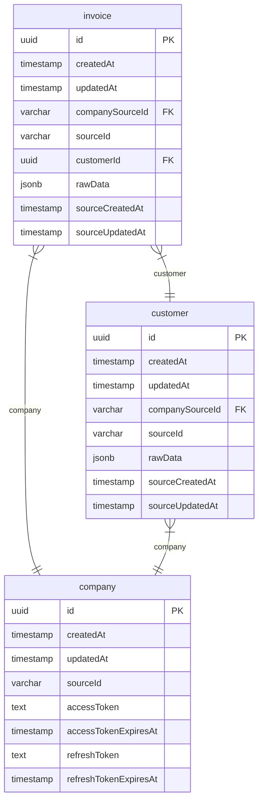

# QuickBooks Integration Server

## Database ERD

```mermaid
erDiagram
  invoice {
    uuid id PK
    timestamp createdAt
    timestamp updatedAt
    varchar companySourceId FK
    varchar sourceId
    uuid customerId FK
    jsonb rawData
    timestamp sourceCreatedAt
    timestamp sourceUpdatedAt
  }
  customer {
    uuid id PK
    timestamp createdAt
    timestamp updatedAt
    varchar companySourceId FK
    varchar sourceId
    jsonb rawData
    timestamp sourceCreatedAt
    timestamp sourceUpdatedAt
  }
  company {
    uuid id PK
    timestamp createdAt
    timestamp updatedAt
    varchar sourceId
    text accessToken
    timestamp accessTokenExpiresAt
    text refreshToken
    timestamp refreshTokenExpiresAt
  }
  invoice }|--|| company: company
  invoice }|--|| customer: customer
  customer }|--|| company: company
```
